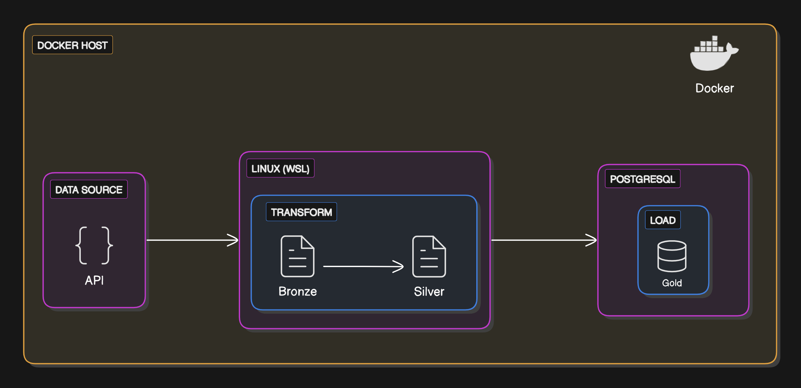

# What is this ?
A simple data engineering (ETL) project that used python to fetch data from an API (not weatherAPI 😂) in JSON.
Then, extract couple of data from the JSON (also saved as JSON), transformed to a csv then load to a `postgreSQL DB` (in Docker)

Suitable for fresh data engineering bootcamp graduate. 
Surely, you can complicate things by adding `Airflow`, `dbt` and `Snowflake` or even `cloud`. 

API LINK: [CLICK HERE](https://restcountries.com/v3.1/all)

Shoutout to: @CoreDataEngineer (API is from them!) 

### Overview (Architecture)


## Background Story

A travel agency reached out, their business model involves recommending tourist location to their customers base on different data points, your task is to build an etl that will process data from the Country api into their Database for predictive analytics by their Data Science team.


### Prerequisites
- Python 3.11.5 if you don't know python learn from CS50P [CLICK HERE](https://www.youtube.com/watch?v=OvKCESUCWII&list=PLhQjrBD2T3817j24-GogXmWqO5Q5vYy0V)

- Docker Desktop (and know docker commands obviously) if not; learn from Nana, She's really good! [CLICK HERE](https://youtu.be/pg19Z8LL06w?si=NSA_Te0FQH1_GJc0)

- Basic Linux commands


#### How to get the project to your device

```bash
# Clone the repository, open your terminal (say git Bash)
git clone https://github.com/bayooyetoro/agency_etl.git

# Navigate to project directory
cd agency_etl
```

## Data Dictionary - Country Dataset

| Column Name | Data Type | Description | Example | Notes |
|------------|-----------|-------------|---------|-------|
| Country_Name | String | Common name of the country used internationally | "France" | This is the generally recognized name of the country in English |
| independence | Boolean | Indicates if the country is independent | true/false | NULL values may indicate disputed status |
| united_nation_members | Boolean | Indicates if the country is a UN member | true/false | Represents official UN membership status |
| start_of_week | String | The day when the week starts in this country | "monday" | Usually in lowercase; common values: monday, sunday |
| official_name | String | The official full name of the country | "French Republic" | Used in formal/diplomatic contexts |
| common_native_name | String | The country's name in its primary local language | "France" | Extracted from the first available native name |
| currency_code | String | Three-letter currency code | "EUR" | Follows ISO 4217 standard; may be empty for countries using multiple currencies |
| currency_name | String | Full name of the primary currency | "Euro" | The official name of the currency in English |
| currency_symbol | String | Symbol used to represent the currency | "€" | May be empty or contain UTF-8 characters |
| country_code | String | International dialing code | "+33" | Includes the '+' prefix and country code |
| capital | String | Name of the primary capital city | "Paris" | May be empty for disputed territories or countries with multiple capitals |
| region | String | Geographic region of the country | "Europe" | Broad geographic classification |
| subregion | String | More specific geographic subdivision | "Western Europe" | May be empty for some countries |
| languages | String | Comma-separated list of official languages | "French, Occitan" | Multiple languages are separated by commas |
| area | Float | Total area in square kilometers | 551695 | Includes both land and water area where applicable |
| population | Integer | Total population count | 67391582 | Based on most recent available data |
| continents | String | Comma-separated list of continents | "Europe" | Some countries may span multiple continents |

### Additional Notes:

1. **Missing Values**:
   - Empty strings ("") are used for text fields where data is not available
   - NULL values may appear in boolean fields (independence, united_nation_members)
   - Numeric fields (area, population) may contain NULL for disputed territories

2. **Data Updates**:
   - Population data may vary based on the most recent census or estimates
   - Political information (UN membership, independence) reflects current status at time of extraction

3. **Multiple Values**:
   - Languages and continents fields may contain multiple values separated by commas
   - Currency information represents the primary or most commonly used currency when multiple exist

4. **Standardization**:
   - Country names follow standard English naming conventions
   - Currency codes follow ISO 4217
   - Region and subregion classifications follow UN M49 standard

5. **Special Cases**:
   - Disputed territories may have incomplete information
   - Dependencies and special administrative regions may have unique patterns in certain fields
   - Some countries may have multiple capitals or no fixed capital
